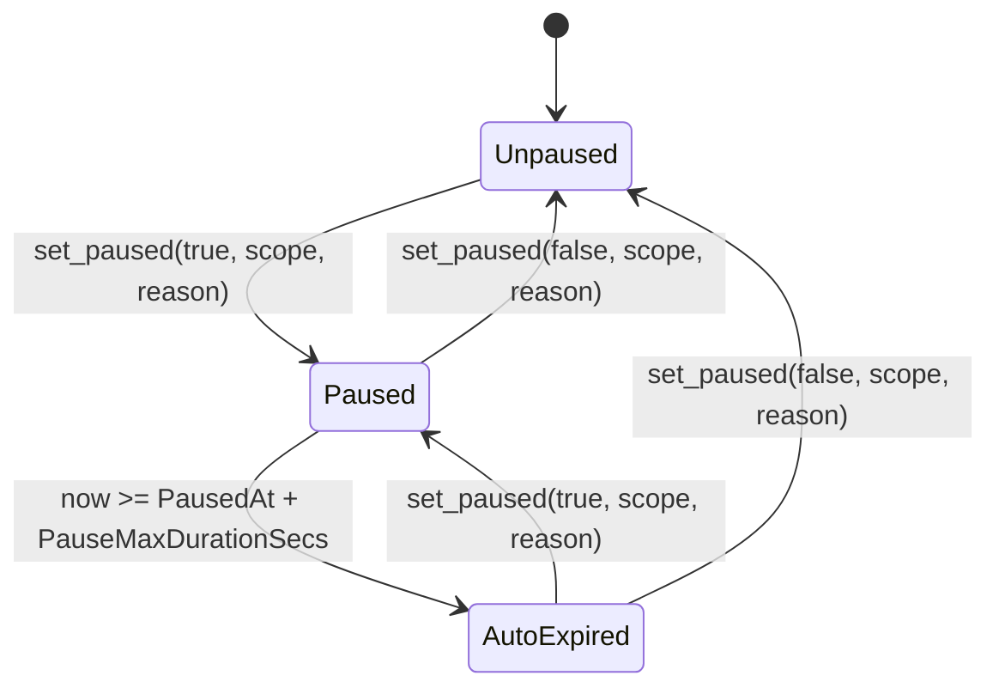

# Operational Pause State Machine

The operational pause (`DataKey::Paused`) is a lightweight incident-response circuit breaker that can be toggled by the current `admin`. It is orthogonal to the compliance legal hold and carries no compliance semantics. The current model stores a typed `PauseState` alongside the legacy boolean for compatibility.

## State Diagram

## States

1. **Unpaused**
   - The default operational state where `DataKey::Paused` is `false` or absent.
   - All standard operations and entrypoints are permitted (unless blocked by other gates such as the legal hold).

2. **Paused**
   - The circuit breaker is active (`DataKey::Paused == true`).
   - `PauseState` records one `scope`, one `reason`, and the activation timestamp. The scope is one of `All`, `Funding`, `Settlement`, `Withdrawal`, or `Claims`.
   - A scoped pause blocks only its matching operation family; `All` blocks every pause-gated entrypoint.
   - The state is within the configured max duration window (`now < PausedAt + PauseMaxDurationSecs`). If the configured duration is `0`, it does not expire.

3. **AutoExpired**
   - `DataKey::Paused` is physically `true` in storage, but the pause has surpassed its maximum duration (`now >= PausedAt + PauseMaxDurationSecs`).
   - The contract evaluates this state exactly as **Unpaused**.

## Enforcing Entrypoints

When the contract evaluates as `Paused` (via the internal `paused_active` predicate), the following entrypoints are blocked, returning their respective typed errors:

| Entrypoint | Error Code | Description |
|---|---|---|
| `fund`, `fund_with_commitment`, `fund_batch` | `PausedBlocksFunding` (210) | Prevents new principal from entering the escrow. |
| `settle` | `PausedBlocksSettlement` (211) | Halts finalizing the escrow. |
| `withdraw` | `PausedBlocksWithdrawal` (212) | Halts SME from withdrawing settled stablecoin. |
| `claim_investor_payout` | `PausedBlocksInvestorClaims` (213) | Prevents investors from claiming payouts on settled escrows. |

## Scoped pause configuration

- `PauseReason` records why the pause was activated: `Incident`, `Token`, `Oracle`, `Compliance`, or `Other`.
- `set_pause_max_duration` configures `PauseMaxDurationSecs`; a nonzero value makes `paused_active` treat the pause as inactive after `PausedAt + duration` without requiring a cleanup transaction.
- `set_pause_rate_limit` configures `(max_toggles, window_secs)` in `PauseToggleLimit`. A nonzero limit applies to every `set_paused` call, including clear calls, within the rolling window. The limit is disabled when `max_toggles == 0`.
- Clearing requires `scope == PauseScope::All` or the currently stored scope. A mismatched scope fails with `PauseScopeMismatch` and leaves the active pause unchanged.
- A legacy deployment with `DataKey::Paused == true` but no `PauseState` is treated as a global `All` pause. `set_paused` writes and clears the typed state together with the legacy pause keys.
